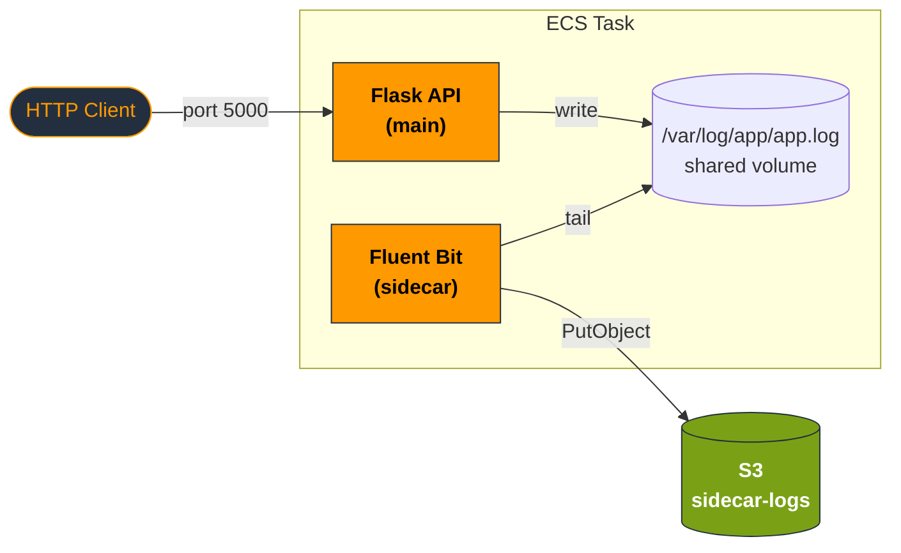
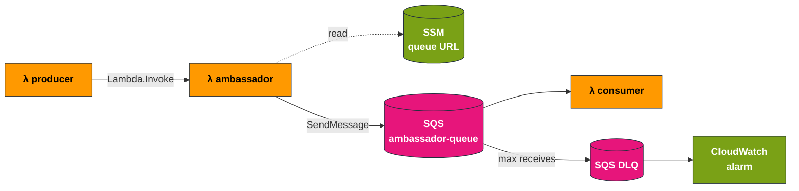
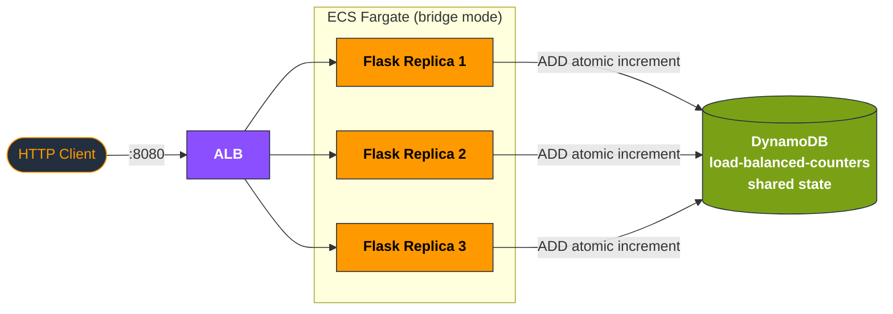
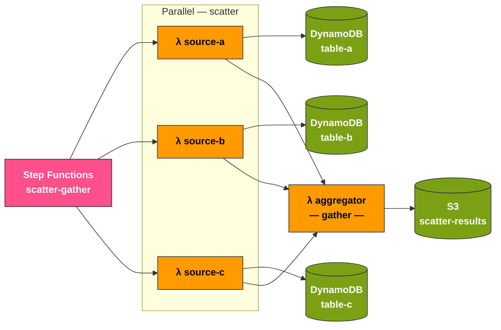
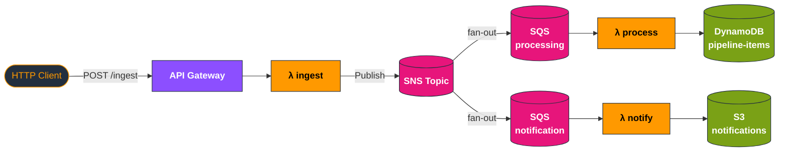
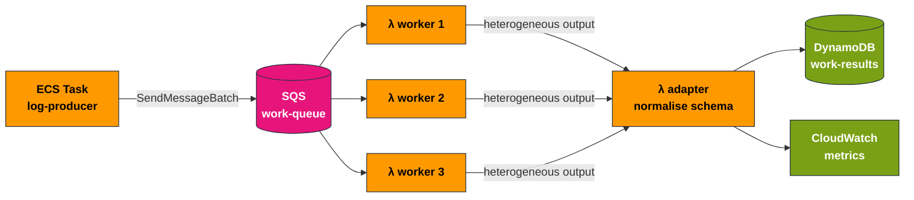

# Distributed Systems Patterns on AWS

A practical implementation of distributed systems design patterns using AWS services, running locally via [MiniStack](https://ministack.org/). Each project implements one or more patterns from *Designing Distributed Systems* by Brendan Burns, using Python and Terraform.

The goal is to build working, observable systems that demonstrate how classical distributed patterns translate into concrete AWS infrastructure.

---

## Patterns Covered

| Project | Pattern(s) | Key AWS Services |
|---|---|---|
| [01 — Sidecar Logging](#project-01--sidecar-logging) | Sidecar | ECS, S3, Fluent Bit |
| [02 — Ambassador Messaging](#project-02--ambassador-messaging) | Ambassador | Lambda, SQS, DLQ, SSM |
| [03 — Load-Balanced API](#project-03--load-balanced-api) | Replicated load-balanced services | ECS Fargate, ALB, Auto Scaling, DynamoDB |
| [04 — Scatter/Gather Search](#project-04--scattergather-search) | Scatter/Gather | Step Functions, Lambda, DynamoDB, S3 |
| [05 — Event-Driven Pipeline](#project-05--event-driven-pipeline) | Event-driven batch processing | API Gateway, SNS, SQS, Lambda, DynamoDB |
| [06 — Work Queue + Adapter](#project-06--work-queue--adapter) | Work queue, Adapter | SQS, Lambda, ECS, DynamoDB, CloudWatch |

---

## Architecture Overview

All six projects share a common MiniStack environment and a set of reusable Terraform modules. Each project deliberately builds on the primitives introduced by the previous ones.

## Prerequisites

### Required tools

| Tool | Purpose | Install |
|---|---|---|
| Docker + Docker Compose | MiniStack and ECS containers | via nix (see below) | 
| Terraform >= 1.5 | Infrastructure as code | via nix (see below) |
| AWS SAM CLI | Lambda local testing | via nix (see below) |
| Python >= 3.11 | Lambda handlers and tooling | via nix (see below) | 
| AWS CLI | AWS API access | via nix (see below ) | 

### NixOS / nix-direnv

A `flake.nix` and `.envrc` are provided for a reproducible development environment. With `nix-direnv` configured, the environment activates automatically on `cd`:

```bash
direnv allow  # run once after cloning
```

This gives you Python, Docker, AWS CLI, and SAM CLI (via virtualenv) and MiniStack, which is started automatically on `cd`. MiniStack credentials and `AWS_ENDPOINT_URL` are exported automatically via `.envrc`.

---

## MiniStack Setup

All projects share a single MiniStack instance. It is started automatically on `cd` (see above):

```bash
cd ministack
docker compose up -d
```

Verify it is running:

```bash
aws --endpoint-url=http://localhost:4566 s3 ls
# Should return an empty list without error as nothing is deployed yet
```

MiniStack exposes all AWS services on a single gateway: `http://localhost:4566`.

All Terraform projects redirect AWS API calls to MiniStack via the provider configuration:

```hcl
provider "aws" {
  region                      = "eu-west-1"
  access_key                  = "test"
  secret_key                  = "test"
  skip_credentials_validation = true
  skip_metadata_api_check     = true
  skip_requesting_account_id  = true

  endpoints {
    s3            = "http://localhost:4566"
    sqs           = "http://localhost:4566"
    lambda        = "http://localhost:4566"
    # all services on the same endpoint
  }
}
```

### Stopping MiniStack

```bash
cd ministack && docker compose down
```

State is ephemeral by default. This is intentional: if infrastructure cannot be recreated from code, it should not exist.

---

## Repository Structure

```
distributed-patterns-aws/
├── ministack/
│   └── docker-compose.yml          # Shared MiniStack instance
├── terraform/
│   ├── provider.tf                 # Reference MiniStack provider config
│   ├── modules/                    # Reusable Terraform modules
│   │   ├── sqs/                    # SQS queue + DLQ
│   │   ├── dynamodb/               # DynamoDB table with optional TTL and GSI
│   │   ├── iam/                    # IAM roles and inline/managed policies
│   │   ├── s3/                     # S3 bucket
│   │   └── lambda/                 # Lambda function + zip packaging
│   └── projects/
│       ├── 01-sidecar/
│       ├── 02-ambassador/
│       ├── 03-load-balanced/
│       ├── 04-scatter-gather/
│       ├── 05-event-pipeline/
│       └── 06-work-queue/
├── docker/
│   ├── flask-api/                  # Main API container (Projects 01, 03)
│   │   ├── app.py
│   │   ├── Dockerfile
│   │   └── requirements.txt
│   ├── log-shipper/                # Log-shipper sidecar (Project 01)
│   │   ├── log_shipper.py
│   │   ├── Dockerfile
│   │   └── requirements.txt
│   └── log-producer/               # Batch work producer (Project 06)
├── docs/
└── shell.nix
```

---

## Project 01 — Sidecar Logging

**Pattern:** Sidecar

### Concept

The sidecar pattern attaches a secondary process to a primary application container. The two containers share resources — a network namespace and a volume — but have entirely separate responsibilities. The main application is unaware of the sidecar. It writes to stdout or a shared volume; the sidecar handles all cross-cutting concerns: log collection, TLS termination, configuration synchronisation.

The invariant is that the main application container remains unchanged regardless of which sidecar is attached. You can swap the sidecar (Fluent Bit → Logstash, for example) without touching application code.



### What is built

- A Python Flask API (`/health`, `/items` GET/POST) that writes structured JSON logs to a shared volume and stdout. Zero knowledge of the log shipper.
- A Python log-shipper sidecar container that tails the log file from the shared volume and ships batches to an S3 bucket.
- An ECS task definition with a shared `app-logs` volume. The sidecar is `essential: false` — if it crashes, the application continues.
- A Docker Compose file for local development that replicates the ECS task structure against MiniStack.

### Key design decisions

- Application logs only to stdout and a file. No SDK, no external dependency, no knowledge of the transport.
- Structured JSON logs allow the log shipper to parse and enrich fields without regex.
- Sidecar is non-essential: log shipping failures must not impact application availability.
- S3 endpoint overridden via environment variable — no code changes between local and real AWS.

### Running

```bash
# 1. Start MiniStack
cd ministack && docker compose up -d

# 2. Provision all resources and start the ECS service
cd terraform/projects/01-sidecar
terraform init && terraform apply

# 3. Generate log entries (flask-api runs as an ECS task on port 5000)
curl http://localhost:5000/health
curl http://localhost:5000/items
curl -X POST http://localhost:5000/items \
  -H "Content-Type: application/json" \
  -d '{"name": "test-item"}'

# 4. Verify logs have landed in S3
aws --endpoint-url=http://localhost:4566 s3 ls s3://sidecar-logs/ --recursive
```

---

## Project 02 — Ambassador Messaging

**Pattern:** Ambassador

### Concept

The ambassador pattern places a proxy between an application and an external service. The application calls a known local interface — the ambassador. The ambassador handles the complexity of the real external system: retries, routing, circuit breaking, environment-specific configuration.

The producer has no direct dependency on SQS. Swapping the transport layer requires changes only to the ambassador Lambda, not to the producer.



### What is built

- Producer Lambda: generates a message payload and invokes the ambassador synchronously.
- Ambassador Lambda: reads queue URL from SSM Parameter Store, sends to SQS with exponential backoff, raises structured error on permanent failure.
- Consumer Lambda: triggered by SQS events, processes messages, logs results.
- SQS queue + DLQ: messages exceeding `maxReceiveCount` route to the DLQ automatically.
- CloudWatch alarm on DLQ depth — non-empty DLQ triggers an alert.

### Key design decisions

- Producer has no SQS imports — cannot accidentally bypass the ambassador.
- Queue URL in SSM enables environment-specific routing at the ambassador layer without code changes.
- Exponential backoff in the ambassador prevents thundering herd on transient SQS failures.

### Running

```bash
cd terraform/projects/02-ambassador
terraform init && terraform apply

aws --endpoint-url=http://localhost:4566 lambda invoke \
  --function-name producer \
  --payload '{}' /tmp/out.json && cat /tmp/out.json

aws --endpoint-url=http://localhost:4566 sqs get-queue-attributes \
  --queue-url http://localhost:4566/000000000000/ambassador-queue \
  --attribute-names ApproximateNumberOfMessages
```

---

## Project 03 — Load-Balanced API

**Pattern:** Replicated load-balanced services

### Concept

Multiple identical, stateless replicas of a service run behind a load balancer. Each request is routed to any available replica. All state that persists across requests must live in an external store — a service holding state in memory gives inconsistent results when replicated.



### What is built

- Flask API extended with a `/counter` endpoint backed by DynamoDB, demonstrating why shared state must be externalised.
- ECS service (bridge mode) running behind an Application Load Balancer on port 8080, confirmed working on MiniStack.
- DynamoDB atomic increment (`ADD`) to prevent lost updates across concurrent replicas.
- Application Auto Scaling (2–10 replicas, 60% CPU target) is defined in the pattern but not provisioned locally — MiniStack support is unverified.

### Key design decisions

- `/counter` uses a DynamoDB conditional update — atomic, no read-modify-write race.
- Health check returns 200 without touching DynamoDB — database slowdown does not trigger replica removal.
- Auto Scaling target at 60% leaves headroom before the service saturates.

### Running

```bash
cd terraform/projects/03-load-balanced
terraform init && terraform apply

# Hit the counter via the ALB on port 8080
for i in $(seq 1 5); do
  curl -s -X POST http://localhost:8080/counter \
    -H "Content-Type: application/json" \
    -d '{"id": "page-views"}' | jq .value
done
```

---

## Project 04 — Scatter/Gather Search

**Pattern:** Scatter/Gather

### Concept

A root node receives a request and fans it out to multiple independent leaf nodes in parallel. Each leaf processes a subproblem. The root aggregates all leaf results into a single response.

Total latency is determined by the slowest leaf. Timeout handling and partial result tolerance are first-class design concerns — the system must decide what to do when a leaf is slow or fails.



### What is built

- Step Functions standard workflow with a `Parallel` state fanning out to three Lambda functions, each querying a different DynamoDB table.
- Aggregator Lambda merging parallel results and writing to S3.
- `Choice` state handling partial failures: two-of-three success proceeds; all-fail transitions to an error state.
- Per-branch timeouts preventing slow leaves from blocking aggregation indefinitely.

### Key design decisions

- Step Functions `Parallel` state handles fan-out and fan-in natively — no coordination code required.
- Partial tolerance: aggregator proceeds with available results rather than requiring all branches to succeed.
- S3 result key derived from execution ID — natural audit trail for every search.

### Running

```bash
cd terraform/projects/04-scatter-gather
terraform init && terraform apply

aws --endpoint-url=http://localhost:4566 stepfunctions start-execution \
  --state-machine-arn arn:aws:states:eu-west-1:000000000000:stateMachine:scatter-gather \
  --input '{"query": "distributed systems"}'

aws --endpoint-url=http://localhost:4566 s3 ls s3://scatter-gather-results/ --recursive
```

---

## Project 05 — Event-Driven Pipeline

**Pattern:** Event-driven batch processing

### Concept

Processing stages are decoupled by queues. Each stage consumes events from its input queue, processes them, and emits to the next stage. No stage has a direct dependency on any other — they communicate only through the queue contract.

This provides resilience (a slow downstream stage does not block upstream), independent scaling (each stage scales on its own queue depth), and replay (failed messages can be reprocessed without re-running the entire pipeline).



### What is built

- Ingest Lambda behind API Gateway: validates payload, publishes to SNS.
- SNS fan-out to two SQS queues: processing and notification.
- Processing Lambda: deduplicates against DynamoDB (TTL-based), scores items, stores results.
- Notification Lambda: writes summary to S3.
- DynamoDB table with TTL for dedup window expiry and a GSI for top-N score queries.

### Key design decisions

- SNS fan-out decouples ingest from all downstream consumers. New consumers subscribe to the topic without touching the ingest Lambda.
- TTL-based deduplication requires no cleanup job — DynamoDB ages out records automatically.
- GSI on score enables top-N queries without a full table scan.

### Running

```bash
cd terraform/projects/05-event-pipeline
terraform init && terraform apply

curl -X POST http://localhost:4566/restapis/.../prod/ingest \
  -H "Content-Type: application/json" \
  -d '{"id": "item-001", "title": "Test Item", "source": "api"}'

aws --endpoint-url=http://localhost:4566 dynamodb scan --table-name pipeline-items
```

---

## Project 06 — Work Queue + Adapter

**Pattern:** Work queue systems / Adapter

### Concept

**Work queue:** A producer places work items on a queue. A pool of competing consumers processes items concurrently. Each item is processed by exactly one worker. The queue provides back-pressure, durability, and load distribution.

**Adapter:** Normalises heterogeneous worker outputs into a standard schema before persistence. The adapter manages the output contract independently of the workers — worker implementations can change without affecting downstream consumers of the normalised output.



### What is built

- ECS batch producer (Python): generates work items, writes to SQS in batches of 10.
- Three competing Lambda consumers triggered by SQS, processing batches independently.
- Adapter Lambda: normalises heterogeneous worker output to a standard schema, writes to DynamoDB.
- CloudWatch custom metrics: queue depth, processing throughput, adapter errors.
- DynamoDB table with GSI for querying results by worker ID.

### Key design decisions

- SQS visibility timeout exceeds maximum Lambda runtime — a message never re-appears while being processed.
- Adapter is a separate Lambda, not logic embedded in workers — normalisation contract evolves independently.
- CloudWatch metrics pushed from both producer and adapter — end-to-end pipeline visibility without a dedicated monitoring service.

### Running

```bash
cd terraform/projects/06-work-queue
terraform init && terraform apply

docker run --network ministack-net \
  -e AWS_ENDPOINT_URL=http://ministack:4566 \
  -e AWS_ACCESS_KEY_ID=test \
  -e AWS_SECRET_ACCESS_KEY=test \
  -e QUEUE_URL=http://ministack:4566/000000000000/work-queue \
  log-producer:local

watch -n 2 "aws --endpoint-url=http://localhost:4566 sqs get-queue-attributes \
  --queue-url http://localhost:4566/000000000000/work-queue \
  --attribute-names ApproximateNumberOfMessages"

aws --endpoint-url=http://localhost:4566 dynamodb scan --table-name work-results
```

---

## Integration Tests

Each project has a self-contained `tests/` directory. Tests run against the live MiniStack stack — `terraform apply` must have been executed for the relevant project before running its tests.

### Running a single project

```bash
cd terraform/projects/01-sidecar/tests
pytest test_sidecar.py -v
```

### Running all projects

```bash
for project in terraform/projects/*/tests; do
  echo "=== $project ==="
  pytest "$project" -v
done
```

### Notes

- Tests use `boto3` and `requests` — both provided by the Nix dev shell (`direnv allow`).
- Project 01's S3 log-shipping test takes ~30 seconds to pass — the sidecar flushes on a 30-second interval.
- Project 05's deduplication test includes a 5-second wait to allow async propagation.
- All other tests complete in under 15 seconds.

---

## Common Conventions

### Infrastructure

- All Terraform projects include the MiniStack provider configuration inline — no shared remote backend required for local development.
- `terraform init && terraform apply` is the single command to provision any project.
- `terraform destroy` tears everything down cleanly.
- Modules in `terraform/modules/` are referenced via relative paths from each project root.

### Python

- All Lambda handlers use the signature `def handler(event: dict, context) -> dict`.
- Structured JSON logging throughout — every entry includes `timestamp`, `level`, `function`, and contextual fields.
- `boto3` clients instantiated at module level to reuse connections across warm invocations.
- MiniStack endpoint injected via `AWS_ENDPOINT_URL` — no special casing in application code.

## References

- Burns, B. (2018). *Designing Distributed Systems*. O'Reilly Media.
- [MiniStack documentation](https://ministack.org/docs)
- [AWS Step Functions developer guide](https://docs.aws.amazon.com/step-functions/latest/dg/welcome.html)
- [AWS SQS developer guide](https://docs.aws.amazon.com/AWSSimpleQueueService/latest/SQSDeveloperGuide/welcome.html)
- [Terraform documentation](https://developer.hashicorp.com/terraform/docs)
- [AWS SAM CLI documentation](https://docs.aws.amazon.com/serverless-application-model/latest/developerguide/what-is-sam.html)
