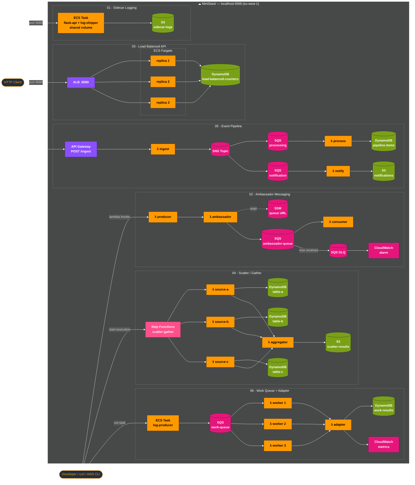

# AWS Architecture — Distributed Patterns AWS

**Scope:** All 6 projects on a shared MiniStack instance (eu-west-1)
**Format:** Mermaid
**Direction:** LR

```mermaid
%%{init: {"theme": "dark", "themeVariables": {"background": "#232F3E", "primaryColor": "#232F3E", "primaryTextColor": "#FFFFFF", "lineColor": "#FFFFFF"}}}%%
flowchart LR
    Dev([Developer / curl / AWS CLI])
    HTTP([HTTP Client])

    subgraph MS["☁ MiniStack — localhost:4566 (eu-west-1)"]
        direction LR

        subgraph P01["01 - Sidecar Logging"]
            direction LR
            ECS01["ECS Task\nflask-api + log-shipper\nshared volume"]
            S301[("S3\nsidecar-logs")]
            ECS01 --> S301
        end

        subgraph P02["02 - Ambassador Messaging"]
            direction LR
            LProd["λ producer"]
            LAmb["λ ambassador"]
            SSM[("SSM\nqueue URL")]
            SQS02[("SQS\nambassador-queue")]
            DLQ02[("SQS DLQ")]
            LCons["λ consumer"]
            CW02["CloudWatch\nalarm"]
            LProd --> LAmb
            LAmb -. read .-> SSM
            LAmb --> SQS02
            SQS02 --> LCons
            SQS02 -- max receives --> DLQ02
            DLQ02 --> CW02
        end

        subgraph P03["03 - Load-Balanced API"]
            direction LR
            ALB["ALB :8080"]
            subgraph ECS03["ECS Fargate"]
                R1["replica 1"]
                R2["replica 2"]
                R3["replica 3"]
            end
            DDB03[("DynamoDB\nload-balanced-counters")]
            ALB --> R1 & R2 & R3
            R1 & R2 & R3 --> DDB03
        end

        subgraph P04["04 - Scatter / Gather"]
            direction LR
            SF["Step Functions\nscatter-gather"]
            SA["λ source-a"] & SB["λ source-b"] & SC["λ source-c"]
            DDBa[("DynamoDB\ntable-a")] & DDBb[("DynamoDB\ntable-b")] & DDBc[("DynamoDB\ntable-c")]
            Agg["λ aggregator"]
            S304[("S3\nscatter-results")]
            SF --> SA & SB & SC
            SA --> DDBa
            SB --> DDBb
            SC --> DDBc
            SA & SB & SC --> Agg --> S304
        end

        subgraph P05["05 - Event Pipeline"]
            direction LR
            APIGW["API Gateway\nPOST /ingest"]
            LIng["λ ingest"]
            SNS[("SNS Topic")]
            QProc[("SQS\nprocessing")]
            QNot[("SQS\nnotification")]
            LProc["λ process"]
            LNot["λ notify"]
            DDB05[("DynamoDB\npipeline-items")]
            S305[("S3\nnotifications")]
            APIGW --> LIng --> SNS
            SNS --> QProc --> LProc --> DDB05
            SNS --> QNot --> LNot --> S305
        end

        subgraph P06["06 - Work Queue + Adapter"]
            direction LR
            ECSProd["ECS Task\nlog-producer"]
            QWork[("SQS\nwork-queue")]
            W1["λ worker 1"] & W2["λ worker 2"] & W3["λ worker 3"]
            LAdapt["λ adapter"]
            DDB06[("DynamoDB\nwork-results")]
            CW06["CloudWatch\nmetrics"]
            ECSProd --> QWork
            QWork --> W1 & W2 & W3
            W1 & W2 & W3 --> LAdapt
            LAdapt --> DDB06 & CW06
        end
    end

    HTTP -->|"port 5000"| ECS01
    HTTP -->|"port 8080"| ALB
    HTTP --> APIGW
    Dev -->|"lambda invoke"| LProd
    Dev -->|"start-execution"| SF
    Dev -->|"run-task"| ECSProd

    %% AWS official service-category palette
    classDef compute   fill:#FF9900,stroke:#232F3E,color:#000,font-weight:bold
    classDef storage   fill:#7AA116,stroke:#232F3E,color:#fff,font-weight:bold
    classDef messaging fill:#E7157B,stroke:#232F3E,color:#fff,font-weight:bold
    classDef edge      fill:#8C4FFF,stroke:#232F3E,color:#fff,font-weight:bold
    classDef mgmt      fill:#E7157B,stroke:#232F3E,color:#fff,font-weight:bold
    classDef sfn       fill:#FF4F8B,stroke:#232F3E,color:#fff,font-weight:bold
    classDef actor     fill:#232F3E,stroke:#FF9900,color:#FF9900

    class ECS01,LProd,LAmb,LCons,R1,R2,R3,SA,SB,SC,Agg,LIng,LProc,LNot,ECSProd,W1,W2,W3,LAdapt compute
    class S301,DDB03,DDBa,DDBb,DDBc,S304,DDB05,S305,DDB06 storage
    class SQS02,DLQ02,SNS,QProc,QNot,QWork messaging
    class ALB,APIGW edge
    class SSM,CW02,CW06 mgmt
    class SF sfn
    class Dev,HTTP actor
```
